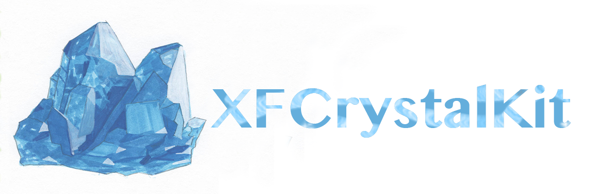
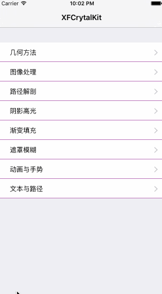

[](http://cocoadocs.org/docsets/XFSettings)


A Quartz/UIKit drawing tool for IOS. Include geometry/Context convenient method, image processing, along path drawing, polygon path, gradient fill, 3D inner outer shadow glow render, gauss blur, animation effect, attributed Text Drawing.
【Quartz / UIKit 绘画工具箱，汇集常用几何和Context操作方法、图像效果处理、路径绘图、多变形状、渐变填充、3D内外阴影高光渲染、高斯模糊、动画效果及属性文本绘制。】



##Installation【安装】
###1、Using Cocoapods【使用CocoaPods】
```ruby
pod 'XFCrystalKit','1.0.0'
```
###2、manual【手动导入】
Drag all source files under floder `XFCrystalKit` to your project.【将`XFCrystalKit`文件夹中的所有源代码拽入项目中】

##Author
Yizzuide, fu837014586@163.com

## License
XFCrystalKit is available under the MIT license. See the LICENSE file for more info.
